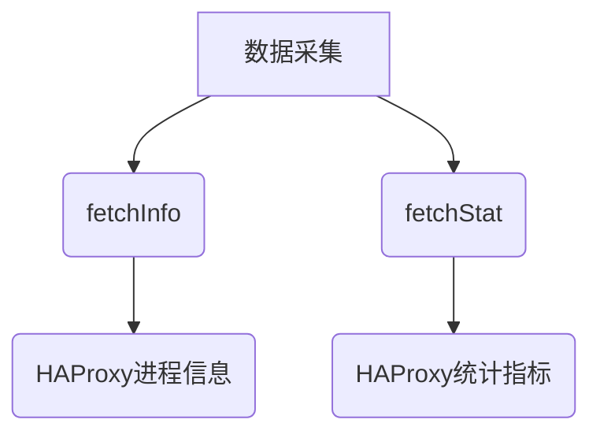
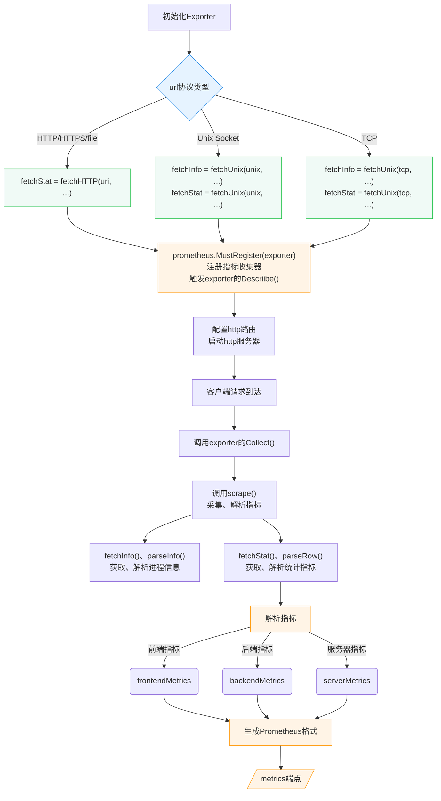
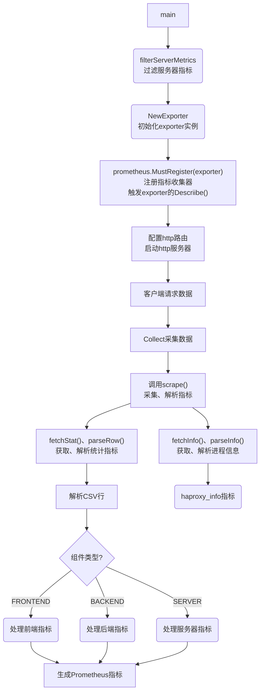
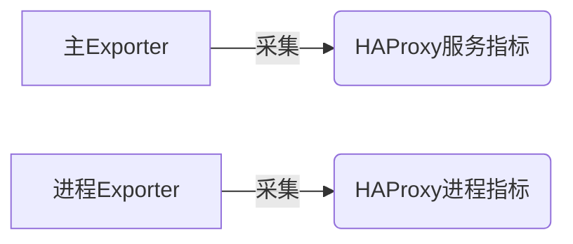
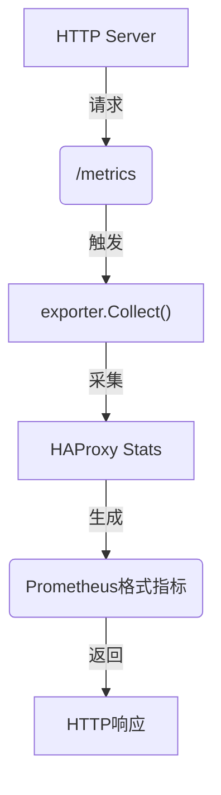

# HAProxy工作原理
1. 数据采集流程：
- 通过NewExporter初始化采集器，根据URI协议类型(http/unix/tcp)创建对应的fetchStat和fetchInfo方法
- Collect方法调用fetchStat获取CSV格式统计数据，使用exportCSV解析指标
- 通过fetchInfo获取HAProxy版本信息，生成haproxy_info指标

2. 指标分类体系：
- 前端指标(frontendMetrics)：会话数、流量统计、HTTP响应码分布
- 后端指标(backendMetrics)：队列状态、错误计数、压缩统计
- 服务器指标(serverMetrics)：健康检查、响应时间、连接状态

3. 协议支持：

- HTTP/HTTPS：通过fetchHTTP实现
- Unix Socket：通过fetchUnix处理本地socket连接
- TCP连接：适用于远程HAProxy实例

## fetchInfo和fetchStat
核心职责：

fetchInfo：

- 调用位置：Collect方法
- 功能：执行`show info`命令获取HAProxy进程元数据
数据结构：
```go
type HAProxyInfo struct {
    Version     string
    Uptime      time.Duration
    ProcessID   int
    // ...
}
```
fetchStat：

-调用位置：同Collect方法
-功能：执行`show stat`命令获取CSV格式统计指标
输出示例：

```csv
pxname,svname,status,scur,qtime...
http-in,FRONTEND,OPEN,12,0...
http-in,server1,UP,5,10...
```

协议适配实现

```go
switch u.Scheme {
case "http", "https":
    fetchStat = fetchHTTP(uri, ...)  // HTTP协议采集统计
case "unix":
    fetchInfo = fetchUnix(..., showInfoCmd)  // Unix Socket采集进程信息
    fetchStat = fetchUnix(..., showStatCmd)  // Unix Socket采集统计
}
```

### 典型调用流程
1. 初始化时根据`--haproxy.scrape-uri`确定协议类型
2. 创建对应的fetch函数闭包
3. 在每次指标收集时并发执行：

```go
infoCh := make(chan *HAProxyInfo)
statCh := make(chan *Stat)
go func() { infoCh <- fetchInfo() }()
go func() { statCh <- fetchStat() }()
```
## HAProxy工作原理图示

关键流程说明：

1. NewExporter 初始化数据采集器
2. 协议适配层处理不同连接方式（代码中的switch语句）
3. exportCSV 解析CSV核心逻辑
4. 指标分类器根据pxname字段分发到不同指标集合
5. Prometheus指标描述符动态生成（metricInfo结构体）
6. 最终通过/metrics端点暴露监控数据

## 函数调用图


## 在haproxy_exporter.go中，exporter和procExporter的关系及作用如下：

### 核心关系


exporter：

- 类型：Exporter
- 职责：通过fetchStat()等方法采集HAProxy服务的运行指标（连接数、请求率等）
- 创建方式：NewExporter()工厂函数
procExporter：

- 类型：collectors.ProcessCollector
- 职责：采集HAProxy进程本身的资源指标（CPU、内存、文件描述符等）
- 创建条件：仅当配置--haproxy.pid-file参数时创建

### 独立创建原因
1. 关注点分离：

```go
// 主指标采集
prometheus.MustRegister(exporter) 

// 进程指标采集（条件触发）
if *haProxyPidFile != "" {
    prometheus.MustRegister(procExporter)
}
```

2. 可配置性：进程监控需要访问`/proc`文件系统，属于可选功能
2. 安全隔离：进程指标采集需要读取PID文件，与主采集器权限需求不同

### 典型场景示例
当启动命令包含PID文件时：

```bash
./haproxy_exporter \
  --haproxy.scrape-uri=http://localhost:9999/;csv \
  --haproxy.pid-file=/run/haproxy.pid
```
此时会同时暴露两类指标：
1. haproxy_*：服务状态指标
2. haproxy_process_*：进程资源指标

## exporter实例和http服务器有什么关系，exporter的describe和collect在什么时候发挥作用​
在`haproxy_exporter.go`中，exporter实例和http服务器的关系如下：


### 核心交互流程：

1. 服务启动时通过prometheus.MustRegister(exporter)注册采集器
2. HTTP服务器配置http.Handle(*metricsPath, promhttp.Handler())
3. 当访问/metrics端点时，Prometheus客户端库自动调用注册的采集器

### 方法作用时机
| 方法名   | 触发时机               | 触发条件                     |
|----------|------------------------|------------------------------|
| Describe() | 首次注册采集器时       | prometheus.Register()调用时  |
| Collect()  | 每次访问/metrics端点时 | promhttp.Handler()处理请求时 |

### 典型执行序列：

1. main() → NewExporter() 创建实例
2. prometheus.MustRegister() 触发Describe
3. web.ListenAndServe() 启动HTTP服务
4. 客户端请求到达 → 调用Collect方法
5. Collect方法中调用fetchStat()获取最新数据

Describe()函数：
1. 注册所有要导出的指标
2. 使得prometheus可以预先了解所有可用的指标，确保后续的数据和抓取过程顺利进行。